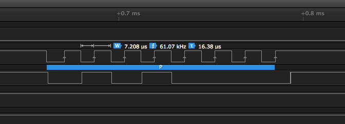
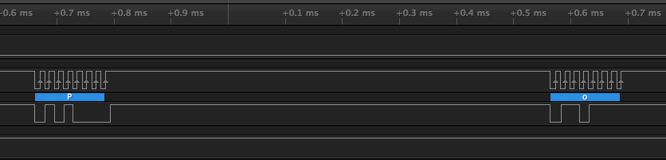

Author: Vincent Gijsen (http://www.vincentgijsen.nl)

# melbus-sniffed-traffic
This repo contains captures from text-on-melbus for volvo

Desperate to find any information regarding sending text to HU in (old) volvo cars, I ended up buying a 2nd hand ipod-interface to find out how to send text to the HU.

i'm not trying to pirate anybodies business, just for personal use, be able to send kodi-data to the display of my HU, so I can also control my car-pc when driving faster then a few km/h.

the captures are made with Saleae logic's awesome Logic, on HU850, in SAT mode (hense the sat id's, see: http://volvo.wot.lv/wiki/doku.php?id=melbus for more details

**Please share any information regarding your descoveries on this subject** as I have with you, for the sake of opensoftware! and your own melbus-application. Please share any info you have or deduce from the captures back here!

(do considder buying the excelent aftermaket options thouh, should they fit your needs)

the decoding settings:

in logic, add the **SPI-decoder** with the following settings:

* *mosi*: channel 2
* *miso*: none
* *clock*: channel 1
* *enable*: channel 0 (not really used)
* *Most significant bit first*
* *8 bits per transfer*
* *Clock is high when idle*
* *Data is valid on trailing edge*
* *Enable line is active low*

# Capture setup

I've connected the melbus device in the back of the car, using the 13pin connector at the back of the RTI dvd-player, and extracting power via the Tuner on the RTI as well.
In the front of the car, I already had a melbus splitter, for my old bluetooth setup.

I removed the bluetooth melbus device and connected the logic-analyser to the 3 data-pins and ground. h


# Timing
see 
 

and

 

for some closeups on timing speeds when acting as master


# details:

the capture file **test-aa-bb-cc-track.logicdata** contains the melbus-traffic from playing a file, with **aaaaaaaaaa**'s and **bbbbbbbbb**'s in the meta-data (to ease disovery)

note I was pressing the *RND* button to switch between text
the ascii/hex decoded parts (of interest) seem:

```csv
1.119487291666667,SPI,MOSI: '0' (0x00)
1.120186041666667,SPI,MOSI: '30' (0x1E)
1.121004083333333,SPI,MOSI: '236' (0xEC)
1.121782708333333,SPI,MOSI: '143' (0x8F)
1.122587166666667,SPI,MOSI: '255' (0xFF)
1.123371416666667,SPI,MOSI: '199' (0xC7)
1.124107625000000,SPI,MOSI: '199' (0xC7)
1.125034083333333,SPI,MOSI: '252' (0xFC)
1.125936500000000,SPI,MOSI: '198' (0xC6)
1.126839125000000,SPI,MOSI: s (0x73)
1.127741666666667,SPI,MOSI: '1' (0x01)
1.128644625000000,SPI,MOSI: '4' (0x04)
1.129547583333333,SPI,MOSI: a (0x61)
1.130450333333333,SPI,MOSI: a (0x61)
1.131353083333333,SPI,MOSI: a (0x61)
1.132255833333333,SPI,MOSI: a (0x61)
1.133158583333333,SPI,MOSI: a (0x61)
1.134061333333333,SPI,MOSI: a (0x61)
1.134964041666667,SPI,MOSI: a (0x61)
1.135866875000000,SPI,MOSI: a (0x61)
1.136769625000000,SPI,MOSI: a (0x61)
1.137672375000000,SPI,MOSI: a (0x61)
1.138575125000000,SPI,MOSI: a (0x61)
1.139477875000000,SPI,MOSI: a (0x61)
1.140380625000000,SPI,MOSI: a (0x61)
1.141283375000000,SPI,MOSI: a (0x61)
1.142186125000000,SPI,MOSI: ' ' (0x20)
1.143089083333333,SPI,MOSI: ' ' (0x20)
1.143992000000000,SPI,MOSI: ' ' (0x20)
1.144894958333333,SPI,MOSI: ' ' (0x20)
1.145797916666667,SPI,MOSI: ' ' (0x20)
1.146700875000000,SPI,MOSI: ' ' (0x20)
1.147603750000000,SPI,MOSI: ' ' (0x20)
1.148506791666667,SPI,MOSI: ' ' (0x20)
1.149409750000000,SPI,MOSI: ' ' (0x20)
1.150312666666667,SPI,MOSI: ' ' (0x20)
1.151215666666667,SPI,MOSI: ' ' (0x20)
1.152118541666667,SPI,MOSI: ' ' (0x20)
1.153021583333333,SPI,MOSI: ' ' (0x20)
1.153924500000000,SPI,MOSI: ' ' (0x20)
1.154827458333333,SPI,MOSI: ' ' (0x20)
1.155730416666667,SPI,MOSI: ' ' (0x20)
1.156633333333333,SPI,MOSI: ' ' (0x20)
1.157536291666667,SPI,MOSI: ' ' (0x20)
1.158439250000000,SPI,MOSI: ' ' (0x20)
1.159342208333333,SPI,MOSI: ' ' (0x20)
1.160245125000000,SPI,MOSI: ' ' (0x20)
1.161148125000000,SPI,MOSI: ' ' (0x20)
```

some other text part (I think posted by the multimedia unit):

```
0.114271791666667,SPI,MOSI: '0' (0x00)
0.114989458333333,SPI,MOSI: '30' (0x1E)
0.115862791666667,SPI,MOSI: '236' (0xEC)
0.116790208333333,SPI,MOSI: '143' (0x8F)
0.117556875000000,SPI,MOSI: '255' (0xFF)
0.118364625000000,SPI,MOSI: '199' (0xC7)
0.119142250000000,SPI,MOSI: '199' (0xC7)
0.120068750000000,SPI,MOSI: '249' (0xF9)
0.120971250000000,SPI,MOSI: '194' (0xC2)
0.121874000000000,SPI,MOSI: s (0x73)
0.122776541666667,SPI,MOSI: '1' (0x01)
0.123679458333333,SPI,MOSI: '129' (0x81)
0.124582291666667,SPI,MOSI: 0 (0x30)
0.125485083333333,SPI,MOSI: 1 (0x31)
0.126387833333333,SPI,MOSI: ' ' (0x20)
0.127290791666667,SPI,MOSI: - (0x2D)
0.128193458333333,SPI,MOSI: ' ' (0x20)
0.129096375000000,SPI,MOSI: t (0x74)
0.129999041666667,SPI,MOSI: e (0x65)
0.130901708333333,SPI,MOSI: s (0x73)


0.140562375000000,SPI,MOSI: '0' (0x00)
0.141263791666667,SPI,MOSI: '30' (0x1E)
0.142083500000000,SPI,MOSI: '236' (0xEC)
0.142844541666667,SPI,MOSI: '143' (0x8F)
0.143629125000000,SPI,MOSI: '255' (0xFF)
0.144511125000000,SPI,MOSI: '199' (0xC7)
0.145290041666667,SPI,MOSI: '199' (0xC7)
0.146216541666667,SPI,MOSI: '250' (0xFA)
0.147118916666667,SPI,MOSI: '194' (0xC2)
0.148021666666667,SPI,MOSI: s (0x73)
0.148924208333333,SPI,MOSI: '1' (0x01)
0.149827166666667,SPI,MOSI: " (0x22)
0.150730000000000,SPI,MOSI: 0 (0x30)
0.151632875000000,SPI,MOSI: 1 (0x31)
0.152535708333333,SPI,MOSI: ' ' (0x20)
0.153438666666667,SPI,MOSI: - (0x2D)
0.154341291666667,SPI,MOSI: ' ' (0x20)
0.155244250000000,SPI,MOSI: t (0x74)
0.156146916666667,SPI,MOSI: e (0x65)
0.157049541666667,SPI,MOSI: s (0x73)
0.157952125000000,SPI,MOSI: t (0x74)
0.158854750000000,SPI,MOSI: ' ' (0x20)
0.159757708333333,SPI,MOSI: ' ' (0x20)
0.160660666666667,SPI,MOSI: ' ' (0x20)
0.161563583333333,SPI,MOSI: ' ' (0x20)
0.162466541666667,SPI,MOSI: ' ' (0x20)
0.163369500000000,SPI,MOSI: ' ' (0x20)
0.164272416666667,SPI,MOSI: ' ' (0x20)
```
notice the first time, no trailing ' '(0x20) but directly behind, it does
